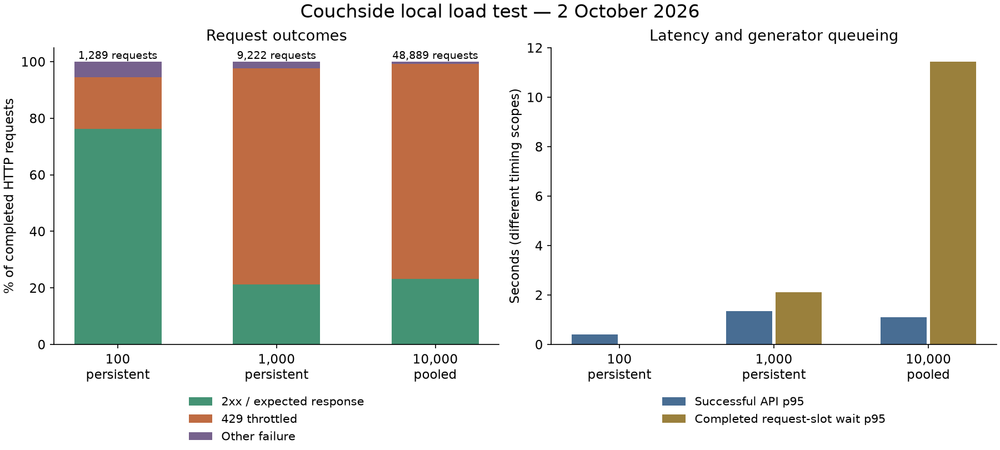

# Couchside load test — 2 October 2026

The current configuration did not pass the tested workload. The 10,000-user stage throttled 76% of completed requests. Successful API p95 was 1.105 seconds, while completed request-slot wait p95 was 11.44 seconds. These are different delays: request latency excludes generator queueing.

This is a short local capacity pilot, not a production certification. The browser journeys passed separately at low concurrency. Production still needs a matching staging test, including the gateway, background refresh jobs and provider quotas.

## Conditions

- Locust 2.46.6 generates seeded randomized HTTP traffic. Playwright 1.62.0 runs actual Chromium UI journeys separately.
- Existing application source at base commit `92c2bd0`, plus the opt-in telemetry and harness changes in this report commit. Application admission limits were preserved: 24 API requests/second globally, burst 120, and three computation slots.
- Loopback target with separate disposable account and cache databases. Caches were copied from existing warm SQLite stores, then warmed further by earlier calibration runs. Account fixtures were prepared before timing; signup capacity was not measured.
- 20% authenticated users with unique accounts; 80% guests; randomized 3–12 second think times; up to 64 active requests per generator worker. Media/backdrop requests were enabled. One generator worker was used.
- Local host: 11 logical CPUs and 18.0 GiB RAM. The production manifest assigns one vCPU and 3,072 MB RAM shared among four applications. Generator and backend ran on the same local host.
- Background warming/refresh jobs were excluded. Missing episode matrices can remain pending. Physical backend provider requests were blocked during the high-volume test; blocked cache misses remain visible as degraded results.
- 100/1,000-user stages used independent persistent transports. The 10,000-user stage used a bounded shared backend connection pool, approximating proxy upstream pooling. It does not test 10,000 physical client connections or browser processes.

## Recorded capacity

| Virtual users | Connection model | Ramp / nominal duration | Completed requests | Failed | HTTP 429 | Successful API p95 | Request-slot wait p95 |
|---:|---|---|---:|---:|---:|---:|---:|
| 100 | persistent | 25/s / 35s | 1,289 | 23.7% | 235 | 394 ms | 0.00 s |
| 1,000 | persistent | 100/s / 35s | 9,222 | 78.8% | 7,058 | 1,360 ms | 2.12 s |
| 10,000 | pooled | 1000/s / 45s | 48,889 | 76.7% | 37,136 | 1,105 ms | 11.44 s |

Final request-event totals, rather than the last periodic CSV snapshot, govern these numbers. Expected guest 401s and legitimate absent-artwork 404s are separate from failures. Failed requests include throttling, server errors, transport errors and two unexpected 415s. Those 415s occurred on JSON title/comparison requests; their cause remains unresolved.

The default experimental targets were at most 1% failed completed requests and successful API p95 of at most one second. Every stage failed. These targets are configurable and are not an agreed production SLA. There were no generator exceptions or Locust CPU warnings, but generator CPU peaked at 92.6% of one logical CPU in the largest stage.

At 10,000 users, at most 64 requests were active and 9,643 users were waiting for a request slot. Queued work cancelled at the deadline is excluded from completed-request totals. Only 3,317 of 12,124 started protocol journeys reached their script end (27.4%); these include journeys with failed API responses and do not establish successful UI completion. Gate percentiles use up to the last 20,000 completed waits.

| Users | Server peak RSS | Server peak threads | Server peak CPU | Generator peak RSS |
|---:|---:|---:|---:|---:|
| 100 | 451.8 MiB | 95 | 100.0% | 69.8 MiB |
| 1,000 | 498.1 MiB | 121 | 104.0% | 181.9 MiB |
| 10,000 | 504.9 MiB | 37 | 104.4% | 520.7 MiB |

CPU uses the process convention where 100% is one logical CPU. Samples were taken once per second. No resource abort occurred. Thread exhaustion was not observed; the thread-per-keepalive server remains a scaling concern. Rate-limit responses close their connections, so even the persistent stages did not retain one live connection per virtual user.

## Server caches and outward calls

Cache percentages count hits divided by hits plus misses for each individual layer. They apply to admitted lookups. A memory miss followed by a disk hit is two different lookups; a rate-rejected request never reaches either. These are not percentages of users served successfully.

| Cache layer | 100 users | 1,000 users | 10,000 users |
|---|---:|---:|---:|
| Episode matrix memory | 734/812 (90.4%) | 486/597 (81.4%) | 363/436 (83.3%) |
| Episode disk | 158/211 (74.9%) | 132/217 (60.8%) | 75/130 (57.7%) |
| Durable image bytes | 19/37 (51.4%) | 19/32 (59.4%) | 4/15 (26.7%) |
| Artwork source memory | 23/60 (38.3%) | 30/46 (65.2%) | 14/16 (87.5%) |
| Compressed page | 113/113 (100.0%) | 1029/1029 (100.0%) | 10217/10217 (100.0%) |

Actual backend outward attempts were **zero by design** during every stress stage. Prevented provider cache misses were:

| Users | Blocked TVmaze API attempts | Blocked image attempts |
|---:|---:|---:|
| 100 | 37 | 18 |
| 1,000 | 28 | 13 |
| 10,000 | 14 | 11 |

This does not mean every answer was cached. Incomplete artwork/provider fixtures caused some controlled 502/503 responses. Large cold-cache provider traffic was not sent to third-party services.

## Actual browser behavior

Two Chromium processes, one mobile-sized and one desktop-sized, ran independent signed-in sessions. All **40 UI actions passed**, with zero JavaScript errors or transport failures. The cohort still recorded six HTTP errors: two expected pre-login guest 401s and four absent-artwork 404s. Eight requests remained in flight at report close.

| Observed live-cohort metric | Value |
|---|---:|
| Physical API requests | 176 |
| Observed wire transfer | 30,542,266 bytes |
| Direct provider/CDN image transfer | 22,438,604 bytes |
| HTTP cache hits | 46 |
| Instrumented service-worker image hits | 63 |
| Instrumented service-worker file hits | 70 |
| Instrumented service-worker shell hits | 8 |

Worker delivery alone does not prove a cache hit. The instrumented counts describe actual cache-match branches; CDP records HTTP caching and physical network transfers separately. Early worker installation traffic can precede instrumentation. These browser measurements are from two actual users and were not extrapolated to 10,000.

Warm comparison reloads took 831–840 ms and transferred 59–65 KB, with no new direct-provider image downloads. Returning to a previously opened show reused title/episode data in both browsers. One browser made no new requests; the other fetched a CBS icon and three related-show posters.

The live backend made **29 physical provider attempts**: 17 TVmaze API, one KinoCheck API, ten TVmaze image and one icon request. Thus there were 18 outward API requests and 11 image/icon requests. Retries would count as separate physical attempts. Direct browser CDN traffic is separate from these backend calls.

A separate guest smoke passed all 20 actions. It used two isolated browser contexts, saved a different show on the destination, copied and opened the real transfer link, chose Add to my list, and verified both saved shows remained. Its cache-only backend produced expected/optional HTTP misses; this is merge-flow verification rather than a provider-availability test.

The randomized workload covers scrolling, genre selection, Popular, repeated exact/substring/reordered/punctuation/typo searches, related and unrelated shows, watched/rated and saved lists, comparisons of two to five shows, view/season/reorder controls, copied links and validated detail ZIP/comparison PNG downloads. Clipboard, storage, transfer and image rendering were executed by real browsers; HTTP virtual users simulate their backend request patterns.

## Implications and next measurements

The measured bottleneck is primarily global request admission, with computation pressure also present. Increasing the rate limit alone would expose more work to three computation slots and roughly one core of server CPU. A production plan should preserve per-user/provider protections while replacing the global ceiling with capacity-based admission, serving public/cacheable responses through a suitable proxy/CDN, and running bounded production HTTP workers with appropriate connection timeouts. Measure cold and warm caches and authenticated writes again before choosing worker count or server size.

A matched isolated Rigbox deployment with separate distributed load generators is still needed to test gateway connections, real production CPU/RAM contention, background refresh, longer steady-state load, account signup/login bursts and provider quotas. No remote stress traffic or production deployment was performed.

The reusable harness and commands are documented in [load-test instructions](../../tools/loadtest/README.md). Compact machine-readable measurements are saved in [the dated JSON report](2026-10-02-load-test.json). Raw Locust CSV/history/HTML, protocol metrics, server JSONL and browser/download evidence are saved with the local Codex artifacts. Private account fixture files are excluded.
