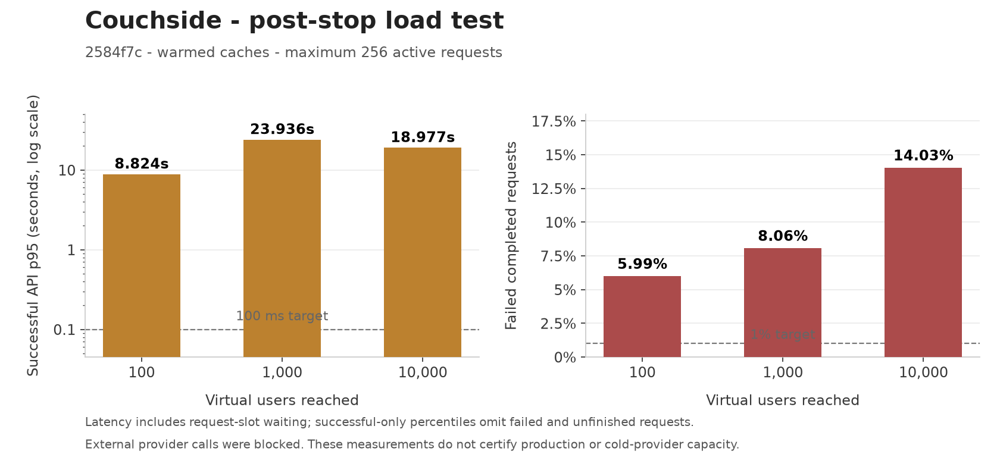
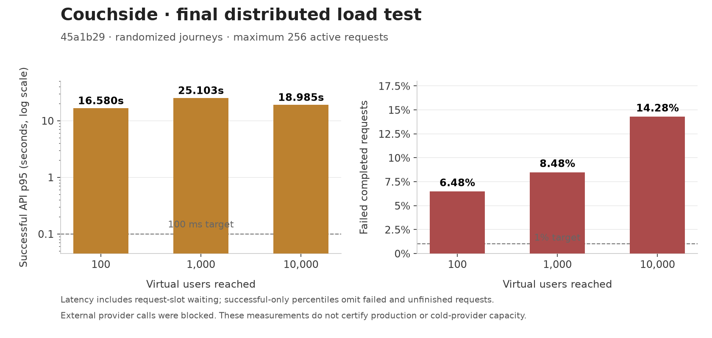

# Couchside capacity and performance — 3 October 2026

Couchside is **not demonstrated ready for 10,000 active users**. The latest `2584f7c` API diagnostic reached 10,000 scheduled virtual users but failed **886 of 6,315 completed request events (14.03%)**. Successful API p95 was **18.977 seconds including generator queueing**, and 1,864 started scripts remained unfinished. The user had stopped three other workspaces before this run; shared-host CPU pressure remained high. Existing application workers and warmed caches were retained, resource ceilings were unchanged, and production Couchside application code was not deployed.

The target means users exploring randomized journeys with think time, rather than 10,000 requests sent once. The report preserves the prior `45a1b29` and `cb248d4` stages as historical diagnostics and separately labels the optional public-cache simulation. The [JSON report](2026-10-03-capacity.json) retains each source, state and scope. Failed measurements in the [2 October pilot](2026-10-02-load-test.md) remain evidence. Current application performance changes have not been deployed to production.

## Measured computation improvements

The recommendation benchmark compared the previous scalar implementation at `d4ca2a0bbab76cc5a9abc936caea941a092f4c87` with the optimized implementation. Both used the 7 September model containing 89,594 shows. It executed 48 distinct mixed Home, Browse, Title and Taste requests, then repeated the same 48 complete bodies. **All 96 full response hashes matched.**

| Operation | First-request median before | First-request median after | Largest after | Repeated-body median after |
|---|---:|---:|---:|---:|
| Home | 280.88 ms | 64.04 ms | 122.34 ms | 0.56 ms |
| Browse | 267.26 ms | 47.94 ms | 100.14 ms | 0.29 ms |
| Title | 224.51 ms | 34.20 ms | 87.63 ms | 0.09 ms |
| Taste | 188.41 ms | 15.98 ms | 44.80 ms | 16.61 ms |

These are unprofiled local component timings on macOS arm64, Python 3.13.2 and NumPy 2.4.6, with one simultaneous caller, no providers and no speculative next-page work. Filter setup is included; model startup, HTTP, network and browser rendering are excluded. There are 12 samples per operation. “First request” means a unique request context; later contexts can reuse public model components. It does not mean a completely empty process for every sample. The largest cold Home and Browse requests still exceeded 100 ms.

The changes move scoring and categorical operations into native arrays while preserving float precision and ordering, precompute public sort data, avoid unnecessary metadata allocation, retain a bounded catalogue LRU, and reuse complete Home/Browse/Title responses. The response cache defaults to 1,024 entries, 32 MiB and 60 seconds per worker. Its key includes full request inputs, filters, model identity and metadata revision. It does not share personal answers across different profiles. Taste remains computed. Staging can explicitly raise the cache budget; the production default was not silently increased.

When foreground requests are queued, the engine now skips starting speculative whole-page generation. Normal quiet-load prefetch and on-demand pagination remain. A three-call diagnostic found 121.5 ms of local continuation CPU after one quiet Home response; its queued version started no continuation. This is a small diagnostic, rather than a population latency claim, and full first-page/pagination parity is covered by tests.

A separate five-show, 423-episode public-data microbenchmark used copied read-only episode bodies and checked equal payload fields:

| Component | Median | Samples |
|---|---:|---:|
| Five full episode-record reads using previous gzip/JSON decoding | 1.4436 ms | 50 |
| Five full record reads through decoded memory cache | 0.0087 ms | 50 |
| Prepare five-show public batch | 4.2036 ms | 20 |
| Retrieve already prepared public representation | 0.0078 ms | 100 |

The five-show response is 198,505 JSON bytes and 50,172 gzip bytes. These results establish avoided decoding and serialization work in one process; they do not establish network or high-concurrency capacity. Episode freshness rules and ended-show timestamps remain enforced.

For an unchanged signed-in list with 100 ratings and 100 saved shows, the local account-poll response shrank from 3,546 to 153 bytes, a 95.7% reduction. In 100 controlled client polls, state application and storage writes both fell from 100 to zero. HTTP median changed only from 0.787 to 0.757 ms; p95 stayed 1.032 ms. The benefit is reduced bytes and repeated client work. Private responses continue to use `no-store`.

## Incremental cold-scoring benchmark

A subsequent narrow change in `45a1b29` moves candidate gathering, per-interest weighted means, nearest hits and dislike penalties into native double-precision arrays, retaining member order and separate multiplication/addition. It also skips zero-weight taste families during scoring while retaining their descriptive statistics. The reference is the exact `cb248d4` engine snapshot replayed immediately before the final variant, rather than the earlier scalar baseline. Float32 model arrays retain their precision; plain-list and double-array affinity inputs preserve their original double precision. Source SHA256 values and raw runs are recorded in `ranking-mean-native-20261003`.

| Operation | Cold CPU median before | Cold CPU median after | Median change | Largest after |
|---|---:|---:|---:|---:|
| Home | 76.42 ms | 59.43 ms | 22.2% lower | 107.62 ms |
| Browse | 51.84 ms | 39.91 ms | 23.0% lower | 91.75 ms |
| Title | 34.53 ms | 27.10 ms | 21.5% lower | 87.72 ms |
| Taste | 15.83 ms | 16.39 ms | 3.6% higher | 45.54 ms |

Total measured CPU time across the 48 distinct request contexts fell from 2,484.37 to 2,006.00 ms, a 19.3% reduction. All 96 complete response hashes matched, including the repeated phase. The repeated phase contributes parity evidence only to this comparison. Thirteen focused cache/native-parity tests and the complete Couchside assertion suite pass. Direct parity tests include custom weights, negative penalties, tied interests, one-candidate scoring, high-precision list inputs and retained normalization on later score calls. The separate canonical research suite still has five failures reproduced against the unchanged reference; it is not reported as passing.

This uses the same 89,594-show model and local macOS arm64/Python 3.13.2/NumPy 2.4.6 environment, one foreground caller and one native thread, with providers and speculative next-page work disabled. Complete-response entries begin cold for the 48 distinct bodies; public model caches can warm during each identical sequence. Filter setup is included and initialization, HTTP and browser work are excluded. Each operation has 12 samples, so the nearest-rank p95 is its maximum rather than a robust population estimate. The largest Home sample still exceeded 100 ms, and Taste did not improve. These results do not establish production latency or a capacity improvement. The completed distributed stages below still failed the experimental capacity targets.

## Repeated taste-mask calculation

The retained `a599ca0` change assigns read-only codes to the catalogue's repeated
genre and subgenre combinations. Large candidate sets gather memoized
contributions using native arrays, reducing Python work per candidate. The index
contains public catalogue identities; personalized contributions remain local
to each taste calculation. Small subsets and custom attribute families retain
the existing scalar path, including unknown versus known-empty data semantics.

Three alternating fresh-process pairs compare exact `67a9963` source with the
retained source. Each process replays 48 distinct Home/Browse/Title contexts
three times, using eight synthetic personas and `known_min` settings of 0 and
85. Complete-answer caching is cleared between sequences; public model/view
caches may warm. All **432 complete response hashes match**, with zero
complete-answer hits. Total measured request CPU fell **12.69%, 5.38% and
5.14%** in the three pairs.

| Operation and setting | CPU median before | CPU median after | Median reduction |
|---|---:|---:|---:|
| Home, `known_min=0` | 154.783 ms | 142.062 ms | 8.22% |
| Home, `known_min=85` | 35.390 ms | 34.211 ms | 3.33% |
| Browse, `known_min=0` | 111.858 ms | 96.659 ms | 13.59% |
| Browse, `known_min=85` | 15.389 ms | 13.963 ms | 9.27% |
| Title, `known_min=0` | 53.447 ms | 49.055 ms | 8.22% |
| Title, `known_min=85` | 9.581 ms | 8.932 ms | 6.76% |

Each table row contains 72 samples per variant. The largest Home/0 CPU sample
rose from **253.144 to 308.785 ms**; these measurements support median and
aggregate savings, without establishing better worst-case latency. The public
code arrays own 716,752 bytes; measured containers and headers bring additional
owned storage to **757,856 bytes**. Existing referenced mask objects, temporary
construction memory and process RSS are excluded from that storage count.

This uses the 89,594-show model on macOS arm64, Python 3.13.2 and NumPy 2.4.6,
with one native thread. Providers are physically blocked, and background/ahead
work is disabled. Request CPU includes filter setup and response-cache insertion;
initialization, hashing, HTTP, browser rendering and network time are excluded.
Canonical and generated engine source share SHA256
`56b5432ef5b71a2d7fda8654804c28151ea25fb32d78974d3874bbe5089266dd`.
Seventeen focused recommendation tests and the full standalone Couchside
assertion suite pass. The source-aligned replay is separate from earlier
artifact-only experiments. This revision has not been deployed or rerun at
10,000 users; the latest full capacity diagnostic above still uses `2584f7c`.

A separate ten-second actual-host sample after test cleanup still found
**86.95% CPU some pressure**, with 24 online CPUs and a one-minute load average
of 48.07 at the sample end. This is a whole-host availability observation,
not application-stage utilization or proof of a capacity improvement.

## Public cache invalidation under unrelated writes

The revised Store advances persisted public-record generations only when actual
episode content, identity or fetch time changes. Recency touches and unrelated
live-details writes preserve unchanged decoded records and prepared public
responses. Public ratings keys use the requested records' generations; cards use
semantic metadata revisions and expiry boundaries. SQL triggers cover writes
from other workers and legacy callers. Capturing a writer's generation before
commit prevents it from accepting a later cross-connection commit as its own.
Pending, refreshing, missing, stale, failed and oversized responses remain
ineligible for prepared caching; bounded memory and source expiry remain enforced.

The final paired component benchmark compares the exact `b358144` Store/PublicAPI
with frozen final source matching `2584f7c`. Five alternating rounds ran 100 read
groups each in six conditions, using five shows with 423 complete episodes, one
unrelated writer show and all 2,233 saved summary rows. Every read group retrieves
the public ratings and cards batches plus five full and five compact decoded
records. All 60 runs preserve complete plain and gzip hashes, ETags and cache
policies. Seventeen separate fixture audit checks pass.

| Condition | Reader CPU before | Reader CPU after | Reader change | Combined reader/writer change |
|---|---:|---:|---:|---:|
| Quiet, primed cache | 0.0467 ms/group | 0.0546 ms/group | 0.0078 ms higher | 0.0079 ms higher |
| Fresh recency reads | 0.0480 ms/group | 0.0558 ms/group | 0.0078 ms higher | 9.0% lower |
| Unrelated live details | 16.147 ms/group | 4.941 ms/group | 69.4% lower | 68.6% lower |
| Forced eligible recency commits | 15.625 ms/group | 4.813 ms/group | 69.2% lower | 68.7% lower |
| Unrelated episode changes | 16.704 ms/group | 4.929 ms/group | 70.5% lower | 56.8% lower |
| Mixed writes | 16.050 ms/group | 5.011 ms/group | 68.8% lower | 53.9% lower |

Values are medians of five per-round averages. Combined measurements use the
paired reader-plus-writer CPU total for each round. In the mixed condition,
writer CPU rose from 3.155 to 3.833 ms/group, while combined CPU fell from 19.205
to 8.860 ms/group. Reporting only the reader improvement would omit trigger and
write-side costs. The quiet path pays a small extra revision query.

Across five rounds of each write-pressure condition, the earlier implementation
recorded 1,000 prepared misses and 5,000 full/compact decode misses. The final
implementation recorded 1,000 prepared hits and no decode misses. After each
100-iteration round, retained prepared representations occupied 25,776,008 bytes
in 202 entries before, versus 255,208 bytes in two entries after. These are cache
payload budgets, not process RSS or observed network traffic. A full 2,233-row
summary reload still occurs after an outside WAL commit and limits the remaining
benefit.

This is warmed local component work at a fixed historical clock where saved
records remain fresh. A separate connection finishes each deterministic write
before the read group starts. It measures reproducible invalidation pressure,
not overlapping write/read throughput, HTTP, providers, authentication, browser
rendering or 10,000-user capacity. Recency commits are deliberately made eligible
every iteration, rather than asserting that ordinary reads write every time.
The original database was opened read-only; writes target disposable fixture
copies. The final evidence is under
`cache-revisions-20261003/final-generation-race-fix`; the earlier paired variant
is superseded and is not mixed into these numbers.

## Taste-cache experiment discarded

An immutable Taste-construction snapshot cache was tested and removed. A JSON
prototype preserved all 96 response hashes but increased unique cold CPU from
1,981.809 to 2,009.711 ms, about 1.4%. Two subsequent binary paired replays each
preserved 72 complete response hashes, but whole-page CPU moved inconsistently:
2.39% lower in one replay and 1.88% higher in the other. Direct Taste construction
medians were approximately 0.38–0.39 ms; the initial broader Ranking constructor
timer also included closeness-vector calculation and interest clustering.

This did not justify another cache or retained mutable state. The canonical and
built engines were restored exactly to the native-scoring source SHA256
`643687bca19ba2321e8707e2601a2fe27dc2d6fff3d22b6cc05a10fba6567515`, and its 13 focused
tests passed. The prototype and its provisional tests are not shipped or counted
as final features. Further reuse work should target measured closeness/clustering
or page work with complete safe keys; this experiment supplies no Taste-cache
performance claim. Evidence: `profile-math-reuse-20261003/results.json`.

## Actual browser behavior

Two isolated real Chromium processes, one desktop and one mobile emulation, executed the same show pool, seeded plans and signed-in journeys as the earlier cohort. All **40 actions passed**, with zero JavaScript errors, fatal failures or network transfer failures. Both matrix tooltip modes were verified using hover on desktop and tap on touch; real detail ZIP and comparison PNG downloads passed.

| Observed cohort metric | Earlier cohort | Updated cohort |
|---|---:|---:|
| Physical API requests | 176 | 125 |
| Observed completed-transfer bytes | 30,542,266 | 28,389,451 |
| Direct provider/CDN image bytes | 22,438,604 | 21,616,900 |
| HTTP cache hits | 46 | 44 |
| Instrumented worker image hits | 63 | 61 |
| Instrumented worker file hits | 70 | 74 |
| Instrumented worker shell hits | 8 | 8 |
| JavaScript errors / network transfer failures | 0 / 0 | 0 / 0 |

API requests fell 29.0% in these observed journeys. The updated cohort used normal startup/background work and a backend already warm from preliminary runs; the older cohort used diagnostic no-background mode. Consequently this table is descriptive, not a controlled before/after production speedup. Six HTTP error responses remained: two expected pre-login 401s and four absent-backdrop 404s.

Updated warm comparison reloads took 62.9–89.5 ms and transferred 1,414 observed bytes each, with one account/session API request and no new direct-provider images. One warm show return made no requests; the other made one physical API request and some additional image requests. An action that sends no requests is observed reuse, not an invented cache-hit count. Worker delivery alone does not establish a cache hit; the worker counters above record actual cache-match branches. Early worker-install fetches can precede debugger attachment.

Server snapshots bracketing this cohort recorded 15 physical outward attempts: 11 TVmaze API, one iTunes API, one KinoCheck API and two TVmaze image attempts. This interval includes normal background activity, so these are not exclusively requests caused by the two browsers. Direct browser CDN image traffic is separate.

A separate guest journey passed all **20 actions**. Its real transfer link opened a second isolated device context, retained the show already saved there, and merged the source show, leaving both saved shows. Guest flows, copied links, misspelled and reordered searches, comparison controls and exported files therefore received actual browser checks; Locust users simulate backend requests rather than executing DOM or clipboard operations.

## Why the VM remains slower

The diagnostic VM exposes four virtual CPUs and 8 GiB RAM, using Python 3.11.2 and NumPy 2.4.6. Source inspection confirmed native scoring was enabled. Sixteen matched local/VM response hashes agreed. Reported cold task CPU time was roughly five times the local value for the same work, with further wall delay. These are guest task counters; a later host check found inconsistent guest task/aggregate CPU accounting, so they do not isolate intrinsic hardware cost or establish physical core usage:

| Request context | Local CPU / wall | VM guest task CPU / wall |
|---|---:|---:|
| Home, known-minimum 85 | 67.17 / 67.18 ms | 344.16 / 670.93 ms |
| Browse, known-minimum 85 | 25.47 / 25.47 ms | 142.88 / 308.72 ms |
| Title, known-minimum 85 | 17.95 / 17.95 ms | 83.85 / 140.48 ms |
| Home, known-minimum 0 | 202.35 / 202.46 ms | 1,024.89 / 2,186.33 ms |
| Browse, known-minimum 0 | 130.08 / 130.09 ms | 684.04 / 1,409.76 ms |
| Title, known-minimum 0 | 116.62 / 116.66 ms | 580.33 / 1,163.85 ms |

These are two deterministic profiles in one extra isolated process, with empty disposable episode data, providers disabled and ahead work off. They are useful diagnostics, not a representative latency distribution. A guest arithmetic probe used 1.00 CPU second over 1.32 wall seconds; aggregate guest CPU steal was 14.7% during the sample. The steal ratios use deltas of the first eight aggregate fields, including the eighth field for involuntary wait; guest/guest-nice fields are excluded from the denominator. The arithmetic is valid, but the observation does not identify a host-level cause or measure quota throttling. [Linux /proc definitions](https://docs.kernel.org/filesystems/proc.html#miscellaneous-kernel-statistics-in-proc-stat) Early staging also ran initial episode refresh planning on the event loop; the current implementation moves planning to its worker.

Twelve sequential HTTPS health requests from the separate generator VM returned 200. The first took 538.2 ms; subsequent requests took 166.3–171.0 ms. These are complete quiet gateway request times, not pure network RTT. A 100 ms end-to-end target is below even this measured quiet-path delay, before recommendation computation.

Read-only host inspection confirmed that the application and generator are separate microVMs on the **same shared compute host with 24 online CPUs**. The application scope has `cpu.max=400000 100000`, allowing up to four CPU seconds per second; the generator ceiling is one. Both use default weight 100 and may run on CPUs 0–23. The inspected parent slice has no quota, and no dedicated CPU affinity is configured. A bandwidth ceiling does not reserve cores. [Linux cgroup CPU limits](https://docs.kernel.org/admin-guide/cgroup-v2.html#cpu-interface-files)

Three earlier host snapshots over 20.003 seconds during the prior corrected traffic recorded 15.263 application-scope CPU seconds, or 76.3% of one host CPU, including VM overhead. No quota-throttle event occurred in that window. Application CPU pressure showed some tasks stalled for 52.1% of the interval and all non-idle scope tasks stalled for 47.3%. Host load was about 53 on 24 CPUs, with recent CPU pressure around 84–85%. These observations identify substantial shared-host scheduling contention. The interval spans the tail of the 1,000-user stage and the 10,000-user ramp, with an inter-stage gap. It is not whole-stage or steady 10,000-user utilization, or a guarantee of how another host will perform. CPU pressure measures waiting for CPU availability. [Linux PSI definitions](https://docs.kernel.org/accounting/psi.html)

The generator used 8.306 host-charged CPU seconds in that interval, or 41.5% of one CPU. Guest process CPU percentages are retained only as guest-accounting observations, because their deltas do not agree with aggregate guest running ticks. The test public hostname resolves from the generator to the gateway; requests traverse the public HTTPS gateway path rather than loopback or a substituted direct VM address.

The current production manifest assigns **one vCPU and 3,072 MB to a workspace containing four apps**. Four HTTP workers do not provide four dedicated CPUs in that workspace. The staging VM and its requested resources must therefore be distinguished from the actual production allocation.

Read-only snapshots after the earlier test VMs stopped found 36 equally weighted Firecracker scopes on 24 visible compute CPUs, with quota ceilings summing to 69. They charged 23.881 CPUs on average over five seconds; host CPU some-pressure delta was 84.53%. This short observation supports persistent shared contention and does not establish dedicated CPU capacity. The compute host itself reports KVM virtualization. The registry offers one `eu-west` compute node and placement does not use CPU pressure; raising a quota does not reserve cores.

After the approved shared-proxy repair, 12 sequential desktop production health requests all returned 200. The first took 207.235 ms; the 11 reused-session requests took 107.564–112.075 ms, median 109.415 ms. These are complete quiet gateway/compute health times, not pure RTT or a production Couchside app change. They are separate from the earlier generator-to-staging 166.3–171.0 ms observations; different origins, targets and timing prevent a causal proxy-fix speedup claim. Maintained inventory places the gateway in `ca-east` and compute in `eu-west`, consistent with the Canada/France backend link. Attribution of the observed delay to individual hops remains an inference.

## Latest post-stop capacity run

The user stopped `career-compass`, `emissary` and `mac-deployments`; their stopped state was observed at 06:50:13 UTC, but exact stop times are unknown. The final full API diagnostic ran afterward on the same shared compute host, using source `2584f7c601ffb25c3e98c81b8ec2ace66458aeae`. Existing four application workers and process/public/durable/account caches were retained from preceding runs. No server restart, resource resize, new host or purchase occurred. This is warmed observational evidence; changed scheduling, timing and retained state prevent a controlled cross-run application speedup claim.

The application ceiling remained four vCPUs/8 GiB; the separate generator ceiling was one vCPU/1.5 GiB. Normal background refresh continued. Guests comprised 80% of users and fixture accounts 20%, with randomized 3–12-second think time. Comparison network IDs were sorted and deduplicated, while display order was preserved. Client-cache simulation was **disabled** and physical provider traffic blocked. The test used a 256-request generator gate; signed virtual identities do not establish 10,000 physical edge clients or browsers. `warm_probability=0.8` controls repeated choices, not a measured cache-hit ratio.

| Virtual users reached | Transport | Ramp / nominal run | Completed request events | Failed | Script ends / starts | Completed events/s | Successful API p95, with gate | Gate-wait p95 |
|---:|---|---|---:|---:|---:|---:|---:|---:|
| 100 | persistent | 25/s / 60s | 1,169 | 70 (5.99%) | 438 / 465 | 18.72 | 8.824s | 0.000s |
| 1,000 | persistent | 100/s / 75s | 2,381 | 192 (8.06%) | 282 / 863 | 27.29 | 23.936s | 45.652s |
| 10,000 | pooled | 500/s / 90s | 6,315 | 886 (14.03%) | 479 / 2,343 | 65.13 | 18.977s | 71.518s |

All user targets were reached and every stage failed the experimental targets of at most 1% failed completed events and successful API p95 at most 100 ms including queueing. These are test targets, not an agreed production SLA. No resource abort, worker death, startup failure, traceback, 415 or 429 response was observed. Four model workers remained alive with four successful startups. The 1,000-user generator emitted **one CPU warning**, so that stage has a generator limitation. Rates use full protocol-observed elapsed intervals, including stop/grace, of 62.450/87.244/96.954 seconds; they are not steady-state maximum throughput or offered arrival rates.

Final protocol events govern totals. The periodic CSV omitted 1/42/5 completed events and 0/4/4 failures across the three stages. The failure-route CSV similarly omitted four late status-0 failures in each larger stage; its route totals are periodic observations, not definitive final counts. Actual received HTTP responses were 1,169/2,215/5,585, because status-0 transport failures have no HTTP response.

At 10,000 users, outcomes were **3,785 HTTP 200, 1,644 expected guest 401, 23 backdrop 502, 133 HTTP 503 and 730 status-0 transport failures**. Expected guest 401s are included in completed events but are not failures. At 100 users, all 70 failures were backdrop 502s from incomplete provider-cache fixtures; the 1,000-user stage had 26 such 502s and 166 transport failures. This separates fixture availability from overload/transport pressure. The failure CSV masks underlying transport exceptions as `HTTP 0`; it does not prove every no-response failure was the same timeout.

The 10,000-user successful API sample contains 1,675 requests. Its p95 without generator waiting was 17.413 seconds; p95 with waiting was 18.977 seconds, p99 51.912 seconds and maximum 84.995 seconds. At most 256 wire requests were active while 9,714 users waited; completed gate-wait p95 was 71.518 seconds. Cancelled waits at stop are excluded. Only 479 of 2,343 started scripts reached their end, leaving **1,864 unfinished**. Script ends may contain failed requests or guest-account no-ops and do not mean successful UI journeys. Slow closed-loop service reduces achieved request rate; that does not make the intended workload cheap.

Only **45 Home, 48 Browse and 33 Title requests** completed successfully in the 10,000-user stage. Their successful p95 including queueing was 20.765/20.299/20.576 seconds. Aggregate API success samples comprise 146 personalized recommendation requests, 429 private-account requests, 94 public list-show POST lookups and 1,006 public metadata/search/media GETs. Failed and unfinished recommendation work must remain visible beside the successful-only aggregate. Per-route successful percentiles without the gate are unavailable; mixed CSV percentiles are not a substitute.

| Observed server layer, hits/lookups | 100 users | 1,000 users | 10,000 users |
|---|---:|---:|---:|
| Full decoded episode records | 192/280 (68.6%) | 282/408 (69.1%) | 634/756 (83.9%) |
| Compact episode memory | 695/990 (70.2%) | 385/548 (70.3%) | 418/590 (70.8%) |
| Episode disk | 198/383 (51.7%) | 82/289 (28.4%) | 79/294 (26.9%) |
| Prepared public JSON/gzip | 28/112 (25.0%) | 15/144 (10.4%) | 105/468 (22.4%) |
| Personalized complete answers | 3/295 (1.0%) | 0/243 (0.0%) | 0/269 (0.0%) |
| Catalogue candidate pools | 342/342 (100.0%) | 286/286 (100.0%) | 314/314 (100.0%) |
| Durable image bytes | 25/61 (41.0%) | 23/38 (60.5%) | 12/24 (50.0%) |
| Artwork source memory | 56/95 (58.9%) | 31/49 (63.3%) | 24/35 (68.6%) |
| Compressed page | 112/112 (100.0%) | 786/786 (100.0%) | 2,112/2,112 (100.0%) |

These are independent layer lookups, not percentages of users or one combined application hit rate. Prepared counters record hits and misses but not whether a miss was retained or bypassed. Complete personal answers require exact complete inputs within bounded retention; these observed misses do not justify relaxing profile, list, settings or seed identity. Deltas aggregate four latest-per-worker snapshots at or before exact stage walls, with at most **0.956 seconds boundary lag**, and include normal background work. Physical upstream attempts were **zero**; prevented TVmaze API attempts were 103/100/131 and prevented image attempts 36/15/12. Blocked misses remain degraded responses, not outward calls or cached success. Actual browser caches are measured separately above; this API diagnostic does not execute them.

| Recorded process resource | 100 users | 1,000 users | 10,000 users |
|---|---:|---:|---:|
| Peak application process RSS sum | 2,972.6 MiB | 3,055.9 MiB | 3,117.7 MiB |
| Peak application threads / file descriptors | 103 / 212 | 103 / 368 | 102 / 413 |
| Peak generator RSS | 158.8 MiB | 885.3 MiB | 303.7 MiB |
| Guest aggregate reported CPU steal | 71.49% | 60.41% | 80.64% |
| Server disconnect/cancellation observations | 25 | 226 | 909 |

RSS sums can double-count shared pages. Guest CPU and steal deltas remain accounting observations, not measured physical-core usage. Cancellation counts are completed telemetry observations, not an exact number of queued jobs avoided; already-running work keeps its slot until completion. No worker death indicates process survival, not acceptable user latency.

The actual-host sampler captured 63 snapshots every five seconds over 310 seconds. The table below uses first/last samples **strictly inside** actual stage walls, covering 50.001/90.000/95.000 seconds. It misses the first **12.630 seconds** and last 3.580 seconds of the 100-user stage; the 1,000-user gaps are 3.405/1.012 seconds and 10,000-user gaps 0.957/4.368 seconds. No missing usage is extrapolated. These interiors include stage ramp and stop/grace, not steady-state-only utilization.

| Actual host scope observation | 100 users | 1,000 users | 10,000 users |
|---|---:|---:|---:|
| Application charged CPU seconds | 48.026 | 62.502 | 82.136 |
| Application average host CPUs charged | 0.961 CPUs | 0.694 CPUs | 0.865 CPUs |
| Application scope CPU full pressure | 63.52% | 53.82% | 68.36% |
| Application quota-throttle events inside selected window | 0 | 0 | 0 |
| Generator average host CPUs charged | 0.159 CPUs | 0.785 CPUs | 0.414 CPUs |
| Host CPU some pressure | 83.29% | 83.04% | 84.05% |

Whole-VM scope CPU includes VM overhead and is distinct from app process RSS or reserved cores. No application quota throttle or OOM was observed between the selected interior endpoints; the unmeasured first-stage gap remains unknown. The full 310-second sampler recorded one application throttle event lasting 0.111 seconds in 06:59:12–06:59:17 UTC, after all stages. Its last sample was 55.632 seconds after the final stage, so whole-window averages are not 10,000-user steady-state utilization. Generator interiors had 2/63/2 quota-throttle events totaling 0.003/0.201/0.004 seconds, with no OOM. Shared-host scheduling pressure remained substantial after the user stopped three workspaces; a four-vCPU ceiling did not reserve four cores. The observations do not certify another existing host's capacity.

Raw final data, independent accounting audit, cumulative-counter recomputation and exact source/cache manifest are under `load-capacity-post-stop-20261003`. This current run remains separate from the preceding API diagnostic, unstable cache simulation and earlier native-scoring stages below.

## Historical public-cache revision API diagnostic

Before those user workspace stops, `2584f7c` completed the same three-stage plan after an implementation restart. Durable public/account fixtures and original source timestamps were preserved; process caches reset at that restart and warmed between stages. Comparison batches sorted IDs but requested every public record, without client-cache simulation. Four workers ran normal background jobs; provider traffic was physically blocked.

| Virtual users reached | Completed request events | Failed | Script ends / starts | Completed events/s | Successful API p95, with gate | Gate-wait p95 |
|---:|---:|---:|---:|---:|---:|---:|
| 100 | 776 | 44 (5.67%) | 251 / 301 | 12.47 | 16.800s | 0.000s |
| 1,000 | 2,287 | 202 (8.83%) | 247 / 805 | 26.71 | 23.033s | 45.571s |
| 10,000 | 6,431 | 978 (15.21%) | 420 / 2,289 | 65.64 | 16.417s | 75.957s |

Every stage failed the experimental targets. The 1,000-user generator emitted one CPU warning, so that stage also has a load-generator limitation. All virtual-user targets were reached; no resource abort occurred. Rates use complete protocol-observed intervals, including stop/grace, of 62.206/85.630/97.969 seconds. The first periodic CSV omits five late completed events; final protocol events govern totals. Completed events include transport failures without an HTTP response: actual received responses were 772/2,138/5,636 respectively.

At 10,000 users, outcomes were 3,761 HTTP 200, 1,692 expected guest 401, 13 backdrop 502, 170 HTTP 503 and 795 status-0 transport failures. Expected guest 401s are not failures. Successful API p95 without generator wait was 4.866 seconds; with waiting it was 16.417 seconds, with p99 50.263 seconds and maximum 84.782 seconds. At most 256 wire requests were active while 9,720 users waited. Only 420 of 2,289 scripts reached their end, leaving 1,869 unfinished. Ends are not successful UI journeys. Home/Browse/Title had only 18/27/17 successful samples, whose p95 including gate was 21.708/21.687/43.934 seconds. Their failed or unfinished work remains material even when public reads dominate a successful-only aggregate.

| Observed server layer, hits/lookups | 100 users | 1,000 users | 10,000 users |
|---|---:|---:|---:|
| Full decoded episode records | 76/216 (35.2%) | 252/382 (66.0%) | 630/759 (83.0%) |
| Prepared public JSON/gzip | 4/74 (5.4%) | 16/140 (11.4%) | 105/486 (21.6%) |
| Personalized complete answers | 2/164 (1.2%) | 0/199 (0.0%) | 0/221 (0.0%) |
| Episode disk | 438/555 (78.9%) | 155/341 (45.5%) | 92/255 (36.1%) |
| Durable image bytes | 11/34 (32.4%) | 21/32 (65.6%) | 6/15 (40.0%) |

These are independent layer lookups, not percentages of users or combined application hit rates. Prepared hit/miss counters do not identify why a miss was not retained. Latest-per-worker telemetry snapshots at or before exact stage walls lagged by at most 0.872 seconds. Normal background work is included. Physical upstream attempts were zero; prevented TVmaze API attempts were 71/91/132 and prevented image attempts 23/10/9. Blocked cache misses remain degraded, not outward calls or cached success.

Application process RSS sums peaked at 2,537.4/2,730.3/2,836.1 MiB, threads at 81/98/102 and file descriptors at 234/386/415. Summed RSS can double-count shared pages. Server cancellation observations were 50/237/923. Generator RSS peaked at 160.4/862.1/302.4 MiB; its one warning at 1,000 users remains in the record. Guest CPU/steal counters are retained with their accounting caveat and are not physical-core usage claims.

Actual-host samples strictly inside the three stage walls cover 60/85/95 seconds, with 2.792–4.198-second boundary gaps rather than extrapolated usage. Application scope charge averaged 0.815/0.693/0.842 visible host CPUs, CPU full pressure was 67.45%/55.72%/67.40%, and no application quota throttle or OOM occurred. Host CPU some pressure was 81.91%/82.23%/84.28%. Generator charge averaged 0.222/0.859/0.434 CPUs, with 2/84/13 quota-throttle events totaling 0.006/0.222/0.083 seconds. These are whole-VM scope charges including VM overhead, not app process RSS or dedicated CPU reservations. Source: `load-capacity-revisions-20261003`.

## Historical opt-in public-cache simulation

The separate 10,000-user simulation ran 06:49:01–06:50:42 UTC using the same already-warm app processes, durable fixtures and matched stage seed. It spans the user workspace stops observed at 06:50:13; exact stop times are unknown. Conditions are explicitly unstable, so it is descriptive evidence rather than a controlled cache-on/off capacity comparison.

It completed 6,514 request events with 919 failures (14.11%), successful API p95 including generator wait of 19.154 seconds and gate-wait p95 of 70.441 seconds. There were 511 script ends from 2,430 starts, leaving 1,919 unfinished. Peak active wire requests were 256 and peak waiting users 9,716. Outcomes were 3,898 HTTP 200, 1,697 expected guest 401, 25 backdrop 502, 176 HTTP 503 and 718 status-0 transport failures. Actual received HTTP responses were 5,796; the periodic CSV omitted one final event. No generator CPU warning or resource abort occurred. The experimental targets failed.

`simulated_public_cache` recorded **35 reusable card records and 20 reusable ratings records**, with **eight whole batches avoided**: four card and four ratings batches. These are per-user metadata eligibility events, separately named from measured browser-cache hits. They do not enter HTTP successes, latency samples or RPS. Partial reuse requests only sorted missing IDs. The per-user model holds no complete response bodies, is limited to 600 records/20 MiB estimated browser-entry bytes/five minutes, respects ratings source expiry and catalogue versions, and rejects pending, refreshing, failed or invalid records. It applies only to public comparisons; real personalized/account/list requests remain. Browser pending polling and persistent IndexedDB storage are not modeled. Logical `network_batches` also includes demand gated or cancelled before completion and is not an HTTP-event count.

Server prepared-cache lookups were 180 hits/501 lookups (35.9%), with one separate coalesced in-flight read. Full decoded records were 596/716 (83.2%); complete personal answers were 0/287. Physical upstream attempts were zero, prevented TVmaze calls 136 and prevented images 13. Telemetry cancellation observations were 879, with snapshot lag up to 0.890 seconds. The host sampler misses the first 11.568 seconds and final 3.758 seconds of the stage; its scoped resources remain labeled unstable. Process RSS peaked at 2,921.4 MiB, threads at 101 and file descriptors at 411. These results remain separate from real Chromium cache observations and the later post-stop stages. Source: `load-capacity-revisions-20261003/simulation-generator`.

## Historical native-scoring capacity stages

The historical run of `45a1b29` used a separate one-vCPU/1.5-GiB generator microVM and four-vCPU/8-GiB application microVM on the same shared compute host. Four application workers ran normal startup/background refresh. Disposable public/account databases carried forward from the prior corrected run; in-process caches reset on supervisor restart and then warmed between sequential stages. Personalized answers had an explicit staging budget of 10,000 entries/128 MiB per worker; the production default remains 1,024/32 MiB. Native library threads were limited to one per worker. Guests comprised 80% of users, prepared authenticated accounts 20%; randomized think time was 3–12 seconds. Provider calls were physically blocked. `warm_probability=0.8` controls repeated choices and is not a measured cache-hit ratio.

| Virtual users reached | Transport | Ramp / nominal run | Completed requests | Failed | Script ends / starts | Completed requests/s | Successful API p95, with gate | Completed gate-wait p95 |
|---:|---|---|---:|---:|---:|---:|---:|---:|
| 100 | persistent | 25/s / 60s | 895 | 58 (6.48%) | 307 / 339 | 14.35 | 16.580s | 0.000s |
| 1,000 | persistent | 100/s / 75s | 2,134 | 181 (8.48%) | 257 / 734 | 24.56 | 25.103s | 46.259s |
| 10,000 | pooled | 500/s / 90s | 6,203 | 886 (14.28%) | 444 / 2,267 | 63.71 | 18.985s | 72.117s |

Every stage failed the experimental targets of at most 1% failed completed requests and successful API p95 of at most 100 ms including generator wait. These are test targets, not an agreed production SLA. No resource abort, generator CPU warning, worker death, 415 response or 429 response occurred. All intended user counts were reached. The throughput column uses the full protocol-observed interval including stop/grace (62.385/86.874/97.364 seconds); it is not a steady-state maximum or an offered-arrival rate. Definitive protocol events include late completions that periodic CSV snapshots can omit: the 1,000-user CSV recorded 2,084/180 completed/failed, while final events recorded 2,134/181.

At 10,000 users, 6,203 completed outcomes comprised 3,679 HTTP 200, 1,638 expected guest 401, 15 HTTP 502, 112 HTTP 503 and 759 transport failures recorded as status 0. Expected guest 401s are included in the completed denominator but are not failures. The 502s occurred on backdrop requests with incomplete provider-cache fixtures. At 100 users, 46 of 58 failures were these backdrop 502s and 12 were transport failures. At 1,000 users, there were 25 HTTP 502s, two HTTP 503s and 154 transport failures. This preserves the distinction between cache-only fixture availability and overload/timeouts. The failure CSV replaces underlying transport exceptions with `HTTP 0`; configured connection/read timeouts are 5/20 seconds, and most high-concurrency failures lasted about 20 seconds. The saved data therefore supports transport failures and timeout pressure, rather than proving every status 0 was the same exception.

The 10,000-user successful API p95 was 15.213 seconds without generator waiting and 18.985 seconds with it; p99 including waiting was 54.704 seconds, maximum 85.185 seconds. Completed gate waits reached 72.117 seconds p95. Cancelled gate waits at stop are excluded. Only 444 of 2,267 started protocol scripts reached their end; 1,823 remained unfinished. The 100-/1,000-user stages ended 307/339 and 257/734 scripts respectively. Script ends can contain failed requests or guest account no-ops and do not establish successful UI journeys.

Only 35 Home feeds, 40 Browse requests and 29 Title requests completed successfully at 10,000 users. Their successful p95 times including gate were 20.617, 20.084 and 21.010 seconds. Failed or unfinished cold recommendations must not disappear behind the faster public/cacheable requests in an aggregate percentile. This is not a controlled before/after capacity improvement: shared-host contention, timing and retained cache state vary.

| Recorded resource | 100 users | 1,000 users | 10,000 users |
|---|---:|---:|---:|
| Peak application process RSS sum | 2,507.1 MiB | 2,688.6 MiB | 2,837.8 MiB |
| Peak application threads / file descriptors | 82 / 234 | 98 / 391 | 99 / 416 |
| Peak generator RSS | 160.8 MiB | 824.1 MiB | 302.0 MiB |
| Guest aggregate reported CPU steal | 68.62% | 62.23% | 78.37% |
| Server disconnect/cancellation observations | 39 | 177 | 907 |

RSS sums can count shared pages more than once. Guest process CPU counters are retained in JSON with their accounting caveat. Cancellation counts describe completed telemetry observations in the stage windows, not an exact count of queued jobs avoided. Queued work is cancelled when the client disconnects; already-running thread work retains its slot until it completes.

This historical run also has 61 actual-host scope samples at five-second intervals over 300 seconds. The table uses the last sample at or before each stage boundary, covering 65/95/100 seconds respectively. Endpoints differ from the exact stage boundaries by up to 4.370 seconds; these include ramps and stop/grace, rather than steady-state-only utilization. CPU charged to the whole VM scope includes emulator overhead and is separate from guest process accounting.

| Actual host scope observation | 100 users | 1,000 users | 10,000 users |
|---|---:|---:|---:|
| Application host-charged CPU seconds | 53.910 | 59.554 | 87.514 |
| Application average host CPUs charged | 0.829 CPUs | 0.627 CPUs | 0.875 CPUs |
| Application scope CPU full pressure | 61.6% | 49.9% | 64.5% |
| Application quota-throttle events | 0 | 0 | 0 |
| Generator average host CPUs charged | 0.238 CPUs | 0.701 CPUs | 0.418 CPUs |
| Host CPU some pressure | 84.1% | 82.3% | 83.6% |

The four-vCPU ceiling did not provide four dedicated CPUs: the application averaged 0.627–0.875 host CPUs in these sampled windows, with no application quota throttling and substantial scheduling pressure. The generator had 5/57/2 quota-throttle events, totaling only 0.016/0.210/0.014 seconds, and its memory-limit event counter rose by 4/14/11 without OOM or killed processes. These generator constraints are part of the test environment, not proof of backend-only limits. Neither VM’s counters certify a different host’s capacity.

Cache values below show hits/lookups, where lookups are hits plus misses in that layer. Deltas aggregate four worker snapshots with at most 1.387 seconds boundary lag and include normal background work.

| Server cache layer | 100 users | 1,000 users | 10,000 users |
|---|---:|---:|---:|
| Full decoded episode records | 25/277 (9.0%) | 149/406 (36.7%) | 402/931 (43.2%) |
| Episode disk | 679/818 (83.0%) | 431/595 (72.4%) | 716/907 (78.9%) |
| Episode matrix memory | 51/619 (8.2%) | 98/441 (22.2%) | 25/412 (6.1%) |
| Prepared public JSON/gzip | 0/86 (0.0%) | 0/130 (0.0%) | 0/462 (0.0%) |
| Personalized complete answers | 1/202 (0.5%) | 0/225 (0.0%) | 0/235 (0.0%) |
| Catalogue candidate pools | 223/231 (96.5%) | 257/257 (100.0%) | 284/284 (100.0%) |
| Durable image bytes | 17/43 (39.5%) | 20/34 (58.8%) | 12/22 (54.5%) |
| Artwork source memory | 17/64 (26.6%) | 16/45 (35.6%) | 14/27 (51.9%) |
| Compressed page | 88/111 (79.3%) | 696/697 (99.9%) | 2094/2094 (100.0%) |

Eligible shared provider requests use a durable same-key lease to avoid duplicate work between workers. Authorization-bearing requests, including TMDB bearer requests, force requests and zero-TTL requests bypass that new lease. The elected episode refresh owner still runs one shared background refresh per host.

Physical backend outward attempts were **zero by design**, including retries. Prevented TVmaze API attempts were 90/103/132 for the three stages; prevented image attempts were 26/14/10. Those are blocked misses, not outward calls or successful cache hits. The stress test therefore does not certify cold provider capacity. Device/browser caching is measured separately in the actual Chromium cohort above; Locust does not execute a browser cache.

A capped generator can hold 10,000 users while many wait for request slots. That is not 10,000 simultaneous backend requests or browsers. End-to-end action delay must include that wait. Slow closed-loop service also reduces the achieved request rate; a low rate under overload is not proof the offered workload was cheap.

The historical `45a1b29` capacity stages used signed synthetic client identities and ran before the shared-proxy reload. Earlier ordinary unsigned health requests from the desktop and generator collapsed to one budget identity because the compute proxy discarded the original clients. The user-approved fix was merged in [Rigbox PR 504](https://github.com/jona62/rig-mvp/pull/504), commit `e7279621c07fe45eaa66f01e2ba59a819b987fdf`. Compute and gateway Caddy deployment jobs completed at 06:07:25/06:07:54 UTC. Live installed configuration matches source and trusts the exact gateway address with strict forwarding and only `X-Forwarded-For` on application ingress. Fifteen dynamic application routes were present after reload; the earlier snapshot recorded only the count, so route-ID set equality is not asserted. Relevant compute/gateway services and public health checks passed. The complete [production deployment pipeline](https://github.com/jona62/rig-mvp/actions/runs/37100742170) passed, including live verification.

At 06:10:49 UTC, four unsigned probes from two independently originating clients passed against the disposable staging app using the new client-address selection code. Desktop and generator identities were distinct; forged forwarded headers from either origin did not change its real selected identity, and the original client address was retained. Raw addresses and fingerprints are excluded. This separately verifies live proxy forwarding and the staged selection code; it does not rerun the capacity experiment or prove distinct addresses for clients behind the same NAT. Couchside's application performance changes remain undeployed to production.

Stress stages block physical provider calls. Actual attempts and prevented misses are separate counters; blocked misses remain degraded responses and cannot count as successful cached service. The application uses copied disposable cache/account databases, and fixtures are provisioned before timing. Signup throughput is outside this test. Normal background work is enabled. Server HTTP byte counters describe response-body sizes; only browser debugger measurements above describe observed completed wire transfer.

Cache hit ratios are reported as hits divided by hits plus misses within each individual layer. A memory miss followed by a disk hit is two lookups, and a rejected request reaches neither. These ratios cannot be added into one application-wide hit percentage or interpreted as percentages of users served successfully.

The prior corrected `cb248d4` run remains a **separate diagnostic**, with the same planned stages but different shared-host timing and retained cache state:

| Prior virtual users | Completed | Failed | Successful API p95, with gate | Completed gate-wait p95 |
|---:|---:|---:|---:|---:|
| 100 | 875 | 47 (5.37%) | 16.458s | 0.000s |
| 1,000 | 2,372 | 194 (8.18%) | 24.290s | 47.204s |
| 10,000 | 6,099 | 921 (15.10%) | 18.572s | 75.180s |

Its complete cache, failure, script and resource measurements remain in the JSON report. Comparing these runs does not isolate the native scoring change: the local paired CPU benchmark establishes that improvement, while both distributed runs fail the capacity targets.

An earlier distributed run is retained as a **superseded diagnostic**, before queued-disconnect cancellation and retry-header fixes. It reached 10,000 virtual users and completed 9,816 requests, with 1,697 failed (17.29%). Successful API p95 including generator wait was 8.212 seconds; p99 was 57.553 seconds and the largest was 82.102 seconds. Completed request-slot wait p95 was 74.029 seconds, with 9,703 users waiting at peak. Only two Home feeds, one Browse and one Title request completed successfully in that stage, so its successful-only percentile is not evidence that cold personalized work handled the load. The JSON retains these failures, cache counters and resources; this is not the final main result.

## Multiple load-generator processes

The load runner now supports opt-in local Locust workers. One aggregate
in-flight request budget is divided among the workers. Final request, endpoint
and journey percentiles are recalculated from merged event histograms; worker
percentiles are never averaged. Each stage requires matching run identities,
complete worker files, the expected master roster, zero final users and clean
process shutdown before it can pass. Missing account fixtures make the requested
signed-in mix incomplete and reject acceptance. Master user totals arrive asynchronously;
summed worker concurrency peaks are reported as upper bounds. The default
remains one process. This enables a separately monitored desktop generator
without claiming that it can sustain the desired traffic.

The native two-worker integration check used a disposable loopback HTTP fixture
with six observed users and an aggregate cap of five requests, divided 3/2.
It recorded **156 definitive completed events, zero failures and six expected
guest 401 responses**. Final master users, generator CPU warnings and remaining
generator processes were all zero. Forty-seven harness/gateway tests and nine
separate workload tests pass. This checks orchestration and accounting; it uses
no Couchside backend, providers, account fixtures or actual databases and
provides no application-capacity measurement. The live localhost:18091 app was
untouched.

## Validation and capacity path

Validation of the earlier capacity implementation includes 119 reported Node tests, 24 load-server/workload/route tests, 19 ASGI unit tests, separate native multiworker and TCP queued-disconnect checks, 14 telemetry tests, 10 client-rate-limit tests, 10 protocol tests, 11 recommendation-cache/native-parity tests, four Discovery tests and the complete standalone Couchside assertion suite. The separate WebKit public-cache check passed. The later narrow scoring change has its 13 focused tests and repeated Couchside assertion run reported separately above. Suite groups are reported independently because some checks overlap; no combined test total is claimed. Account sync, ratings enrichment, compare controls/exports, personalization, exclusions, filters and pagination were retained.

Current `2584f7c` validation separately passed 33 episode tests, 17 public API tests and 21 ASGI tests. Three interleaved commit-gap regressions reproduce on `694e2bd` and pass corrected source; they are included in the episode suite. The implementation before that narrow race fix passed 29 load-tool/gateway/protocol/simulation tests, nine workload tests and the complete standalone Couchside assertions. The discarded Taste prototype was removed and the restored native engine's 13 focused tests passed. The component benchmark's 17 fixture audit checks are distinct from the 17 public API unit tests. These groups are not added into a fabricated overall total.

The verified iOS Safari focus-font guard remains intact. This capacity work did not change form typography or disable page pinch zoom. Mobile Chromium emulation and WebKit caching tests do not replace native Safari keyboard, reduced Page Zoom and rotation checks; those were not rerun as part of this experiment.

Further optimization should target measured closeness, interest clustering or page work with bounded memory and full response parity. Safe cache keys must include the full normalized ordered profile, effective settings, candidate/filter identity and model/metadata revisions; seed, visit/day, diversity, list exclusions and request-specific work must stay correctly partitioned or local. Distinct first-time profiles still require work.

The user chose an existing host and rejected a purchase. The existing Rig compute host was reused and inspected after the three workspace stops, and remained saturated. No quiet alternative existing host has been identified. New infrastructure and purchases remain unapproved; no resource resize or production Couchside application deployment occurred. Further capacity claims require measured available CPU scheduling and private direct-service latency separately from the actual public gateway path, with a separately monitored generator. Longer steady-state/cold/warm runs, account writes/signup, provider quotas and real browser journeys remain necessary before certification. More workers or a larger CPU ceiling alone cannot establish reserved capacity, and this report certifies no hardware sizing requirement.

## Evidence

Raw local artifacts are under `ratings-design` in the Codex visualization directory recorded in the JSON report. The initial recommendation evidence is `recommendation-performance-20261003/results.json`; incremental cold-scoring evidence is `ranking-mean-native-20261003/results.json`; public decoding evidence is `capacity-public-data-20261003.json`; account polling is `account-poll-performance.json`; browser evidence is `load-browser-capacity-20261003` and `load-browser-capacity-guest-20261003`; VM diagnosis is `capacity-gap-20261003`, including the saved `gateway-rtt.json` health-request measurements and `proxy-path.json` client-identity diagnosis. Earlier directories marked `invalid` are excluded. Private account fixtures, signing keys, credentials and request bodies are excluded from the report.

The [load-test instructions](../../tools/loadtest/README.md) describe the reusable Locust/Playwright harness, isolation controls and metric definitions. Historical native distributed generator CSV/log/protocol results, server JSONL and resource samples are under `load-capacity-native-20261003`; the prior corrected run is under `load-capacity-final-20261003`, and the earlier superseded diagnostic is under `load-capacity-before-disconnect-20261003`. Earlier host scope snapshots are in `capacity-gap-20261003/host-scheduling.json`; the historical native full-run samples are in `capacity-gap-20261003/host-scheduling-vector-ranking-20261003.jsonl`.

Live proxy deployment and unsigned-client proof are recorded in `capacity-gap-20261003/caddy-proxy-deployment-20261003.json` and `proxy-path-after-fix.json`. After the earlier native-run verification, the staging app share was made private and both owned test workspaces were stopped successfully. An independent read-only check at 06:12:11 UTC confirmed the private share, both stopped test workspaces and the running production workspace. Recoverable fixtures and measurement artifacts were preserved. Production Couchside application code, source and resource allocation were untouched; the shared-proxy repair was the separately approved infrastructure deployment.

Current revision evidence is `cache-revisions-20261003/final-generation-race-fix`, `profile-math-reuse-20261003`, and `load-capacity-revisions-20261003`, with independent API/simulation audits and separately labeled host samples. The final post-stop run is `load-capacity-post-stop-20261003`, including `derived-stage-summary.json`, `post-stop-independent-audit.json` and `derived-host-audit.json`.

The later retained mask-grouping component evidence is
`recommendation-profile-next-20261003/retained-results.json`, with separate
baseline and retained source snapshots and three pairs of raw runs. Its
`host-revalidation.json` records the subsequent ten-second availability sample.
These additions do not replace the earlier capacity measurements or their
historical report-audit hashes.

The multiple-worker harness integration evidence is
`load-local-workers-smoke-_v9b4ej6/smoke-verification.json` and its
`load-results.json`; earlier rejected shutdown smokes remain separate artifacts.

The owned test workspaces had resumed after the historical 06:12 cleanup. Final stop actions completed at **07:00:47 UTC**; the independent verification recorded at **07:01:26 UTC** in `load-capacity-post-stop-20261003/cleanup-verification.json` confirmed both test workspaces stopped, the test app private, and production Couchside still running with live health HTTP 200. The three workspaces stopped by the user were left stopped. Recoverable fixtures and artifacts were preserved. No cloud purchase, new host, resource resize or production Couchside application deployment occurred.
