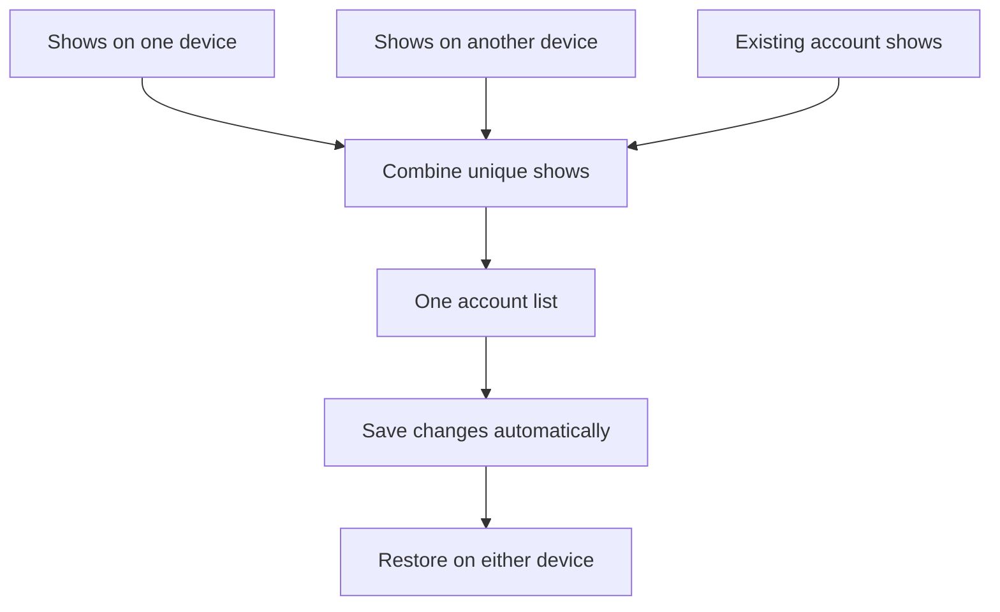

# How Couchside combines lists

Signing in joins this device's guest shows to the account automatically. It does
not replace the account with a device snapshot or treat sign-in time as edit time.

| Situation | Result |
| --- | --- |
| Each guest device has different shows | Both sets join the account. |
| Both guest devices have the same show | It appears once. |
| A guest rating differs from the account rating | Keep the account rating. Guest lists have no reliable edit dates. |
| A guest copy contains a show removed from the account | Keep the recorded removal. |
| Signed-in devices edit different shows | Keep both edits. |
| Signed-in devices change the same rating without seeing each other's edit | Keep the choice already acknowledged by the account. The person can change it again after seeing that choice. |
| One device removes a rating while another changes it | Keep the removal. |
| Another device adds and removes a show while this device is offline | The removal history prevents its older pending addition from restoring that show. |
| The person adds a show again after seeing its removal | Save the deliberate new addition. |
| A combined list would exceed the app's capacity | Keep the complete account and device copies, explain the limit, and pause saving instead of cutting the list short. |

The account panel shows whether changes are up to date, saving, or waiting for a
connection. There is no routine sync button or merge checkbox. A retry action
appears only after a failure; expired sessions ask the person to sign in again.
Offline changes stay with their account on that device. Opening or returning to
the app, reconnecting, and the visible app's minute check reconcile other devices.

## Implementation and compatibility

The server imports `guest_state` during the login transaction, with credential
rechecking, capacity validation, account update and session creation committed
together. Imports only add missing shows, preserve account ratings and settings,
and consult account-specific removal history. Repeating an import is safe.

Signed-in clients compare changes with their last acknowledged account state.
Each removal records the server revision in `account_removals`; responses supply
removals newer than the requesting device's known revision. Session reads filter
history only when the requesting account ID matches the authenticated owner.
State and history share a SQLite read snapshot. No device clock decides conflicts.
Successful saves use the existing revision check, so stale writes first reconcile
with the current account rather than overwriting its list.

An older browser tab contributes only changes against its own acknowledged base,
not every show in its stale snapshot. If two pending tab copies exceed capacity,
both remain in the account-specific cache until they can be combined safely.
Each tab's pending snapshot has an origin and sequence; newer snapshots replace
older ones from that tab, and persisted receipts prevent a canceled edit from
returning through another tab's old cache.
Pending removals also travel between tabs and remain pending until the account
acknowledges them. This includes an addition canceled before its first upload:
the account records the removal even when neither acknowledged list contained
the show, so another offline device cannot restore that canceled addition.
Capacity checks run before the display sanitizer, which is intentionally allowed
to discard malformed local input. Account state still uses version 3.

State writes require sync protocol 2. An already open older app keeps its local
changes but must refresh before writing, so its earlier guest-merge rules cannot
bypass the new account protections.

Removal history starts with this update. Earlier removals have no stored history
and cannot be reconstructed reliably from old guest copies. Account tables and
removal history stay on the persistent volume; account deletion cascades to its
removal records. Sessions, origins, CSRF checks and account ownership boundaries
continue to protect every write.
